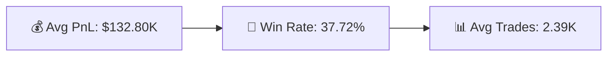

# 📊 Fear vs Greed: Trader Behavior Analysis

### 📉 End-to-end analysis of how market sentiment impacts trader performance (Python → SQL → Power BI)
This project analyzes **27K+ trades** from Hyperliquid alongside Bitcoin sentiment data to understand how **Fear vs Greed** impacts trader profitability, behavior, and risk using **KPI** such as PnL, Long short ratio, WinRate etc.

The pipeline covers:
**Data Cleaning → Feature Engineering → Aggregation → Visualization**

## ⚙️ Tech Stack
- **Python (Pandas, NumPy)** → Data cleaning & feature engineering  
- **SQL** → Aggregations & metric computation  
- **Power BI** → Dashboard & visualization  
- **Jupyter Notebook** → Analysis workflow

## 📈 Key KPIs

## 🧮 KPI Definitions

- **PnL (Profit & Loss)**  -Net profit or loss per trade 

- **Avg PnL**  -Average profit per trade across traders or segments  

- **Win Rate** - % of profitable trades  = (Profitable Trades / Total Trades)  

- **Trade Count** - Total number of trades executed  

- **Avg Trades per Trader**  - Measures trading activity intensity  

- **Activity Group** - Trader segmentation based on trade frequency (Low / Medium / High activity)  

- **Long vs Short Ratio**  - Distribution of BUY vs SELL trades  

## 🔍 Key Insights

- Fear markets deliver the highest profitability and win rates.  
- Increased trading frequency negatively impacts overall performance.  
- Buy and sell activity remains balanced across all sentiment conditions.  
- Greed markets show higher activity but lower trading efficiency.  

## 🎯 Strategic Recommendations

- Reduce trading frequency during Greed and focus on high-conviction trades.  
- Increase participation during Fear to capitalize on volatility-driven opportunities.  
- Prioritize trade quality and execution over trade quantity.  
- Improve timing and risk management rather than relying on directional bias.   

## 🔄 Project Workflow

1. **Data Cleaning**
   - Converted timestamps & standardized dates  
   - Handled missing values  
   - Merged trading + sentiment datasets  

2. **Feature Engineering**
   - Created performance & behavior metrics  
   - Segmented traders based on activity  

3. **Aggregation**
   - Computed sentiment-level KPIs  
   - Derived trader-level performance metrics  

4. **Visualization**
   - Built interactive Power BI dashboard  
   - Highlighted performance & behavioral patterns  
